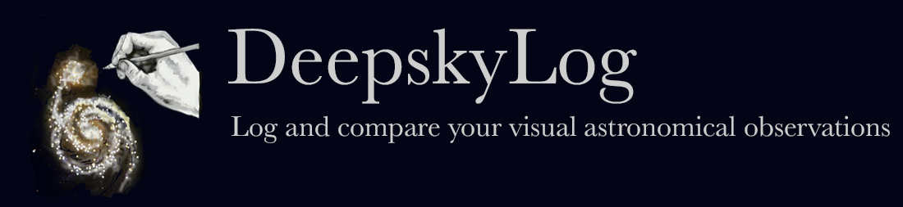

# DeepskyLog

> Attention all amateur astronomers! Are you tired of manually logging your astronomical observations and managing your
> equipment? Say hello to DeepskyLog - the one-stop solution for all your astronomical needs. With DeepskyLog, you can
> easily log your observations, manage your equipment and keep track of all your data in one convenient place. No more
> cluttered notebooks or missed observations - DeepskyLog is user-friendly and accessible from anywhere. Upgrade your
> astronomical experience with DeepskyLog. Try it now!

* Visit [DeepskyLog](https://www.deepskylog.org) and start using a web application to prepare, log, and compare visual
  astronomical observations.
* You can find more than 150,000 observations and 17,000 sketches in DeepskyLog. There are visual observations of
    * Deep-sky objects
    * Comets
    * Planets
    * Moon
    * Sun
* Photographic observations are unfortunately not allowed in DeepskyLog. A very good website to log your photographic
  observations is [Astrobin](https://www.astrobin.com/welcome/).
* Be part of the community and start sharing your observations and sketches today!
* DeepskyLog is free to use and will always be free to use. If you want to sponsor DeepskyLog, we will use it to upgrade
  our servers to improve the speed and the disk space. Sponsoring can be done by clicking the **Sponsor** button on top
  of the [GitHub page](https://github.com/DeepskyLog/DeepskyLog).
* If you like DeepskyLog, give it a star. It means a lot to the people maintaining it.

## Want to contribute?

* Read our [Code of Conduct](CODE_OF_CONDUCT.md).
* DeepskyLog is always looking for amateur astronomers to help improving DeepskyLog. You don't need to be a programmer
  to help us! We are also looking for Deep-sky database maintainers, translators, testers, bug triaging, documentation
  writers, ... As it is unfortunately not always clear to observe, amateur astronomers can still do astronomy by helping
  out the DeepskyLog team! Be part of the DeepskyLog community today!
* If you want to help us improve, take a minute to read the [Contribution Guidelines](CONTRIBUTING.md) first.
* If you find a problem with the behavior, database or translation of DeepskyLog,
  please [open an issue](https://github.com/DeepskyLog/DeepskyLog/issues/new/choose).

## API

A very basic API is available to use (parts of) DeepskyLog in your own applications. At this moment, the API is used
in the [pydeepskylog](https://github.com/DeepskyLog/pydeepskylog) python library (which is in turn used in the
[PiFinder](https://www.pifinder.io/) software).

### Table with API calls

| API call                  | Description                                                               |
|---------------------------|---------------------------------------------------------------------------|
| /api/instruments/{userid} | Returns the list with all instruments (and information) for a given user. |
| /api/eyepieces/{userid}   | Returns the list with all eyepieces (and information) for a given user.   |

## Credits & Sponsors

* This repository is maintained by the [DeepskyLog organization on GitHub](https://github.com/DeepskyLog).
* Logos, names and trademarks are not to be used without the explicit consent of the maintainers or owners of the
  DeepskyLog organization.
* Our website is running on a web server sponsored by [VVS - Vereniging voor Sterrenkunde](http://www.vvs.be/), the
  amateur astronomy association in Belgium.

## The DeepskyLog team

The first version of DeepskyLog was developed in 2004 by [Wim De Meester](https://github.com/WimDeMeester)
and [Jan Vanautgaerden](https://github.com/orgs/DeepskyLog/people/janvanautgaerden). Over the years, a lot of developers
helped in making DeepskyLog what it is today.

The responsibilities in the DeepskyLog team are:

| Responsibility           | Who?                                            |
|--------------------------|-------------------------------------------------|
| Project Management       | [WimDeMeester](https://github.com/WimDeMeester) |
| Development              | [WimDeMeester](https://github.com/WimDeMeester) |
| Issues, Deepsky database | [TomCorstjens](https://github.com/TomCorstjens) |
| Documentation            | [SkyNomad](https://github.com/SkyNomad)         |
