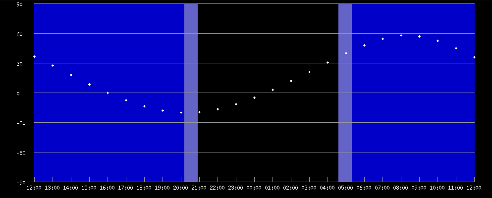
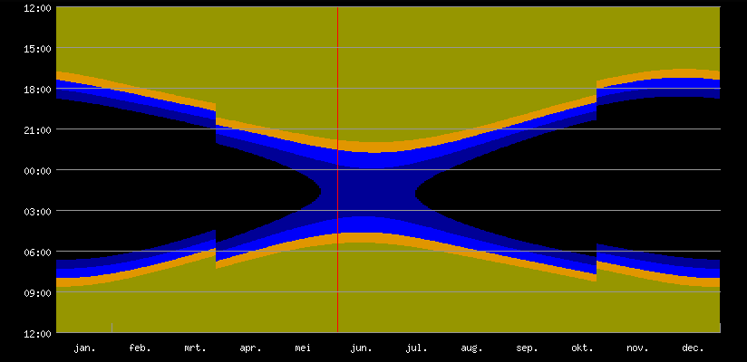

# What's new in DeepskyLog.laravel

## Functionality

+ Added responsivity of DeepskyLog by not reloading the whole page every time.
+ Added planets, moon (craters, maria, ...), and sun to the list of objects. Comets don't have a separate module anymore, but are now part of the main DeepskyLog module.
+ Add dark mode for the website (night mode was already available).
+ Pictures for locations, instruments, eyepieces, filters and lenses.
+ Eyepieces have a brand and a type now. A generic name is shown for the eyepieces of other observers.
+ Eyepiece overview page now shows the magnification, true field of view and pupil size for any given instrument and lens.
+ Totally rewritten messages, now sorted in threads, easy to add new users to the thread.
+ Add country of origin to the settings. This makes it possible to search for all observations done by inhabitants of a country (even if they did a lot of observations in another country).
+ Using local time everywhere in DeepskyLog.
+ Registration doesn't need a manual intervention anymore. The newly registered user receives a mail to activate the registration.
+ Logging in and registering can be done using the observers facebook, github, google or twitter account.
+ Added a plot of the altitude of the object dusing the night:

+ Added a plot of the length of the night for every location:

+ Added a lot of tests for DeepskyLog functionalities.

## Technology

+ Laravel 8
+ Bootstrap 4
+ Livewire 2
