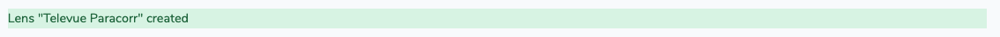
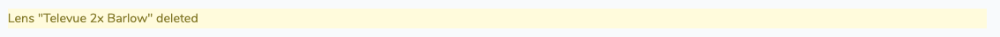

# Development tricks

<!-- @import "[TOC]" {cmd="toc" depthFrom=1 depthTo=6 orderedList=false} -->

<!-- code_chunk_output -->

- [Development tricks](#development-tricks)
  - [Flash messages](#flash-messages)
  - [Internationalization](#internationalization)
    - [Translate the strings](#translate-the-strings)
  - [Authentication](#authentication)
    - [Using policies](#using-policies)
    - [Checking user permissions](#checking-user-permissions)
  - [Tests](#tests)
  - [Select library](#select-library)
  - [Datatables](#datatables)

<!-- /code_chunk_output -->

## Flash messages

```php
use Coderello\Laraflash\Facades\Laraflash;

laraflash('text')->success();
```



```php
use Coderello\Laraflash\Facades\Laraflash;

laraflash('text')->warning();
```



```php
use Coderello\Laraflash\Facades\Laraflash;

laraflash('text')->info();
```

## Internationalization

All strings in DeepskyLog should be translated. This means that all strings should have the following notation (blade syntax):

```blade
{{ _i("My English text") }}
```

or in php syntax:

```php
_i("My English text")
_i('Translated string with %s', $str);
```

For plural strings, use the _n() function (in blade, where n is the number to use):

```blade
{{ _n('Translated string', 'Translated plural string', $n) }}
```

or in php syntax:

```php
_n('Translated string %s', 'Translated plural string %s', $n, $str);
```

### Translate the strings

Poedit doesn't "understand" blade syntax. When using blade views you must run

```bash
php artisan gettext:update
```

in order to compile all blade views to plain php before updating the translations in Poedit.

Open Poedit and read in the language file to translate (in resources/lang/i18n/LANGUAGE/messages.po). Click on the update catalogue button in POedit to bring in the latest strings to translate.

## Authentication

In the Controller (in app/Http/Controllers/), make sure to add 'verified'. This makes sure the user has a verified email address to view the requested page.

```php
$this->middleware(['auth', 'verified'])->except(['show']);
```

OR

In routes/web.php:

```php
Route::resource('lens', 'LensController', ['parameters' => ['lens' => 'lens']])->middleware('verified');
```

### Using policies

To make sure only the correct users can do things:

```bash
php artisan make:policy LensPolicy --model=Lens
```

Add in AuthServiceProvider:

```php
    protected $policies = [
        'App\Lens' => 'App\Policies\LensPolicy'
    ];
```

In LensController (eg edit method):

```php
        $this->authorize('update', $lens);
```

### Checking user permissions

To check if the user is a guest:

In PHP:

```php
Auth::guest()
```

In Blade:

```blade
@guest
    // The user is not authenticated...
@endguest
```

To check if the user is authenticated:

In Blade:

```blade
@auth
    // The user is authenticated...
@endauth
```

To check if the user is administrator:

In PHP:

```php
auth()->user()->isAdmin()
```

In Blade:

```blade
@admin
    // The user is the administrator...
@endadmin
```

The column 'type' in the user table should be set to 'admin' to gain admin privileges.

## Tests

The tests are located in the test directory. They can be executed using:

```bash
phpunit
```

## Select library

For the dropdown menus, we use select2. Nothing has to be done for enabling select2.

## Datatables

DeepskyLog uses jquery datatables. To make a DataTable model, execute the following command:

```bash
php artisan datatables:make --model Lens
```

Adapt the app/DataTables/LensDatatable.php file.

To show the datatable:

```php
    {!! $dataTable->table(['class' => 'table table-sm table-striped table-hover']) !!}
```

and

```php
@push('scripts')

{!! $dataTable->scripts() !!}

@endpush
```
